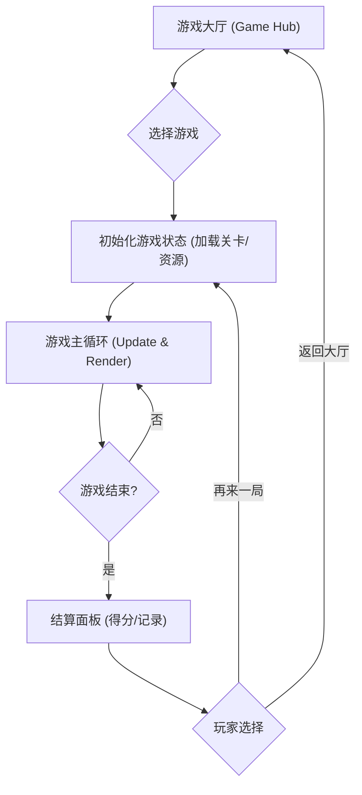

## 1. 产品概述
构建一个包含12款经典/变体小游戏的「Web 游戏合集」平台（Game Hub）。
- 目的：提供一个开箱即用、设计精美、支持桌面与移动端游玩的在线游戏平台，囊括经典的 2048、Flappy Bird、Pong、太空侵略者、打泡泡、连连看、扫雷、推箱子、节奏点击，以及贪吃蛇、俄罗斯方块、打砖块的增强变体版本。
- 架构特性：都使用静态网页的方式，纯原生 HTML/CSS/JS 实现，无任何构建依赖，双击 index.html 即可直接游玩。
- 目标受众：休闲游戏玩家、怀旧游戏爱好者。
- 核心价值：高颜值的现代化界面，多关卡设计，统一的控制与结算体验。

## 2. 核心功能

### 2.1 游戏模块（12款游戏）
1. **2048**：4×4网格，滑动合并相同数字块，每次有效移动随机生成新块，具备平滑动画过渡与得分计算。
2. **Flappy Bird**：重力/跳跃物理系统，程序化生成随机高度管道，精确的碰撞检测与帧循环。
3. **Pong (乒乓)**：双挡板反弹小球，支持人机对战（AI）或双人同屏，基于击球位置动态调整碰撞法线与速度角度。
4. **Space Invaders (太空侵略者/小蜜蜂)**：敌机阵列整体左右移动并逐步下压，支持玩家射击与实体碰撞框检测。
5. **Bubble Shooter (打泡泡)**：底部发射彩色泡泡，同色3个以上连通消除，使用 Flood Fill/BFS 算法检测并掉落悬空泡泡。
6. **Onet (连连看)**：连接相同图案，路径拐点≤2，基于 BFS 的路径搜索与规则判定。
7. **Minesweeper (扫雷)**：点击方块递归展开空白区域（Flood Fill），数字逻辑推理，确保“首次必不炸”。
8. **Sokoban (推箱子)**：基于网格地图的箱子推动解谜，提供多个关卡数据（JSON），支持撤销（栈）。
9. **Rhythm Clicker (节奏点击)**：音轨播放配合音符下落，基于时间轴与判定窗口计算得分（谱面数据解析）。
10. **贪吃蛇变体**：穿墙机制、随机障碍物、特殊道具（加速、减速、额外得分），状态机控制关卡生成。
11. **俄罗斯方块变体**：引入 Hold（保留块）功能、7-bag 随机生成算法，以及 SRS（超级旋转系统）解决边缘旋转问题。
12. **Breakout变体 (打砖块)**：基于现有雏形增加多球、激光射击、掉落道具（概率机制），支持关卡编辑与切换。

### 2.2 页面结构
| 页面名称 | 模块名称 | 功能描述 |
|-----------|-------------|---------------------|
| 游戏大厅 (Home) | 游戏选择网格 | 展示12款游戏的卡片，包含封面、名称与简介，点击进入对应游戏。 |
| 游戏界面 (Game) | 游戏画布与UI | 统一的顶部栏（返回大厅、得分、关卡）、居中的游戏区域、底部的控制提示与设置（音量、暂停）。 |
| 结算面板 (Result) | 成绩结算 | 游戏结束时弹出，显示得分、最高分，提供“再来一局”与“返回大厅”按钮。 |

## 3. 核心流程
用户通过游戏大厅选择任意一款游戏，进入对应的游戏界面。游戏开始后进入主循环（输入处理、状态更新、渲染）。游戏结束（胜利/失败）弹出结算面板。

## 4. 用户界面设计
### 4.1 设计风格
- **整体氛围**：Retro-Modern（复古现代风）。结合经典像素游戏的内核与现代 UI 的平滑、毛玻璃（Glassmorphism）、大圆角设计。
- **色彩搭配**：
  - 背景：深邃的夜空蓝（#0F172A）或暗紫色，带噪点纹理。
  - 主题色：霓虹色系（如赛博黄、电光蓝、荧光粉），用于高亮和特效。
- **字体**：
  - 标题与得分：像素风格字体（如 'Press Start 2P'）或粗体无衬线字体。
  - 正文与说明：清晰的现代无衬线字体（Inter 或 Roboto）。
- **组件样式**：
  - 游戏卡片：悬浮放大效果（Scale），发光边框。
  - 按钮：带按下动画（Active 状态下沉），鲜艳的背景色与投影。

### 4.2 页面设计概览
| 页面名称 | 模块名称 | UI 元素 |
|-----------|-------------|-------------|
| 游戏大厅 | 头部区 | 巨大的 "GAME HUB" 标题，发光效果。 |
| 游戏大厅 | 游戏列表 | 响应式 CSS Grid，每张卡片对应一款游戏，悬停播放简单 CSS 动画。 |
| 游戏界面 | 游戏区 | 画布（Canvas/DOM）带圆角和阴影，顶部浮现当前分数。 |

### 4.3 响应式设计
- 桌面端：优先使用键盘控制（WASD/方向键、空格）。大厅采用多列网格布局。
- 移动端：大厅自动变为单列或双列。游戏界面提供屏幕虚拟按键或手势滑动（Touch events）支持。

## 5. 关卡设计思路
为推箱子、打泡泡、连连看、太空侵略者、打砖块等游戏内置多个（至少 3-5 个）递增难度的关卡配置文件。如打砖块的关卡可通过二维数组或字符串矩阵定义不同砖块的分布。
