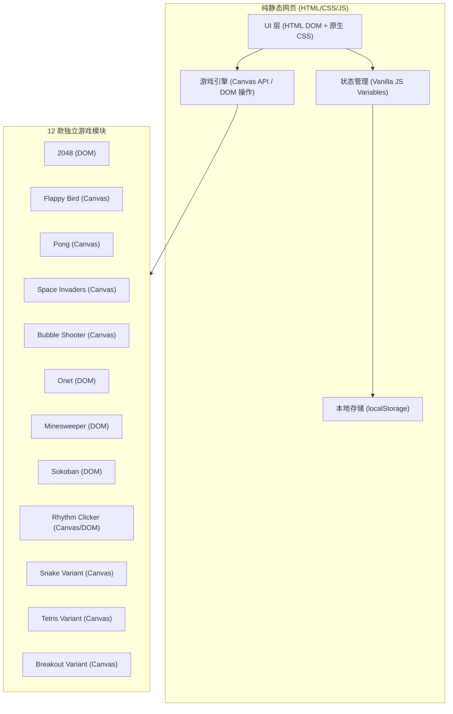

## 1. 架构设计



## 2. 技术说明

### 前端技术栈
- **核心理念**：纯静态网页（Vanilla JS + 原生 HTML/CSS），无需构建工具，无需安装依赖，双击 `index.html` 即可直接在浏览器中游玩。
- **框架**：无第三方框架（Zero Dependencies），保证极致轻量化和极速加载。
- **样式**：原生 CSS3（Flexbox/Grid 布局，CSS 动画，CSS 变量实现主题色）。
- **渲染方案**：
  - DOM 渲染：2048、扫雷、推箱子、连连看（利用 CSS Grid 和 Transition 实现平滑动画）。
  - Canvas 渲染：Flappy Bird、Pong、太空侵略者、打泡泡、节奏点击、贪吃蛇变体、俄罗斯方块变体、打砖块变体（帧循环与频繁重绘）。

### 核心算法实现策略
- **帧循环 (Game Loop)**：基于 `requestAnimationFrame`。
- **2048**：基于二维数组矩阵的滑移、数字合并算法，以及 DOM 元素的平移和缩放动画。
- **连连看 (Onet)**：基于图论的 BFS（广度优先搜索），判断两个方块的连通路径是否≤2个拐点。
- **打泡泡 (Bubble Shooter)**：六边形网格坐标系，碰撞检测后，使用 Flood Fill 寻找同色连通分块，再用 BFS 检查悬空块并使其掉落。
- **扫雷 (Minesweeper)**：点击“0雷”方块时触发 Flood Fill 递归展开空白区域。第一步点击后再布雷以保证“首次必不炸”。
- **俄罗斯方块 (Tetris Variant)**：实现现代标准的 7-bag 伪随机生成包，以及 SRS（超级旋转系统），包含 Kick Table 墙踢判断。
- **推箱子 (Sokoban)**：二维数组存储关卡拓扑数据（支持多个硬编码 JSON 关卡），利用数组栈记录历史状态实现撤销功能。
- **节奏点击 (Rhythm Clicker)**：利用 Web Audio API 获取 `currentTime`，结合预设的谱面数据阵列判断击打精度。

## 3. 目录与路由结构

采用多页或单页哈希路由方式，所有游戏均放在一个独立目录中：
```text
/
  index.html            # 游戏大厅入口
  css/                  # 大厅与公共样式
  js/                   # 大厅逻辑
  games/
    2048/               # index.html, style.css, game.js
    flappybird/         # index.html, style.css, game.js
    pong/               # index.html, style.css, game.js
    spaceinvaders/      # ...
    bubbleshooter/      # ...
    onet/               # ...
    minesweeper/        # ...
    sokoban/            # ...
    rhythmclicker/      # ...
    snake_variant/      # 包含穿墙/道具逻辑
    tetris_variant/     # 包含SRS/7-bag
    breakout_variant/   # 包含多球/道具
```

## 4. 存储模型 (Storage)
使用 `localStorage` 保存玩家的最高得分记录和进度（如推箱子的已解锁关卡）。
数据结构示例：
```javascript
// 保存在 localStorage 中的 key: "GameHub_Data"
{
  "highScores": {
    "2048": 20480,
    "flappybird": 42
  },
  "unlockedLevels": {
    "sokoban": 3
  }
}
```
